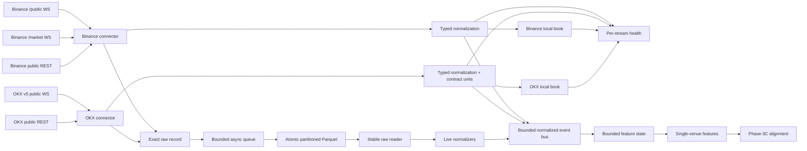

# CVF-01 Architecture

## Scope

CVF-01 remains a modular monolith and paper-trading research system. Phase 3B calculates typed,
single-venue observations over the bounded feature state shared by live collection and replay.
It contains no credentials, private APIs, market scores, signals, or order execution.

| Area | Phase-2 status |
|---|---|
| Configuration, models, logging | Implemented and tested |
| Binance/OKX public collection | Implemented |
| Typed normalization and unit conversion | Implemented with fixtures |
| Exact venue-specific order books | Implemented with gap/checksum tests |
| Lifecycle, heartbeat, recovery, dedupe | Implemented with deterministic transports |
| Per-stream health and clock-skew accounting | Implemented |
| Bounded raw Parquet storage | Implemented |
| Ordered event bus and deterministic clock/scheduler | Implemented |
| Raw scan, normalized replay, compaction audit, CI | Implemented |
| Bounded venue/symbol state and feature availability | Implemented |
| Deterministic single-venue feature calculations | Implemented |
| Cross-venue features/persistence, signals, trading, backtests, UI | Not active |

## Implemented data flow



Raw bytes are queued before normalization. A parse failure therefore does not erase the
offending frame. Storage failure is fatal and observable; it is not converted into silent
data loss.

Each normalized consumer has its own bounded FIFO queue and sequential worker. A full queue
applies producer backpressure. A failed consumer is recorded and surfaced as a fatal pipeline
error during publish or shutdown; it cannot silently disappear while collection continues.

Replay selects raw rows by time, venue, symbol, and channel, then merges them with an explicit
stable tie-break rule. `ReplayClock` and `DecisionScheduler` advance from event time without
depending on asyncio task ordering. Live and replay both publish into `NormalizedEventBus`.

Feature state is keyed by `(exchange, canonical symbol)`. Each channel family has an independent
event-time window with a configured duration and hard item cap. Default late events are dropped;
an insertion policy can admit events within a configured lateness bound. Window queries use
`(start, end]`, so decision-boundary behavior is deterministic.

The feature-side book applies absolute normalized levels. Updates arriving before a snapshot are
bounded and replayed after that snapshot. Any generation change immediately invalidates the old
book window and restarts warmup. Sequence gaps, crossed books, missing OI, stale OI, blocked
stream health, and pipeline backlog remain structured unavailability rather than numeric zeros.

`SingleVenueFeatureEngine` closes every trailing window at an explicit decision timestamp. It
calculates trade flow, sequence-valid book/OFI observations, price and volatility, OI context,
funding/premium crowding, and public-sample liquidation activity. Feature UUIDs are derived from
strategy, venue, symbol, window, decision time, and book source boundary. A current book that
already includes a post-decision update is rejected instead of being silently rewound.

## Connector lifecycle

`PublicWebSocketSession` is venue-neutral and owns:

- connect timeout;
- subscription/resubscription;
- receive deadline;
- protocol or text heartbeat;
- exponential reconnect delay with bounded jitter;
- stable-connection backoff reset;
- unsubscribe/close on shutdown;
- observable lifecycle events.

It catches only known transport/session failures. Unexpected application/storage exceptions
end the connector monitor and fail collection.

Binance uses two connections because current USDⓈ-M routing separates public depth/BBO from
market trades/mark/liquidation. OKX uses one v5 public connection and an alphanumeric request
ID.

## Ordering and local books

### Binance

Each configured symbol has an isolated bounded diff buffer. Every WebSocket generation
invalidates the old book and requests `/fapi/v1/depth`. Activation follows the documented
snapshot overlap rule. Once active, each diff must satisfy `pu == previous u`. Absolute
quantity replaces a level and zero removes it. Gaps, retry conditions, and buffer overflow
increment the generation and force a new snapshot.

### OKX

`books` snapshot/update state is isolated per symbol. `prevSeqId` must equal the active
`seqId`; the documented same-sequence keepalive and maintenance reset are accepted by the
state machine. A gap invalidates the book and reconnects for a fresh snapshot.

Current production checksum values are zero after the June 2026 deprecation, so continuity is
validated by sequence IDs. Nonzero historical fixtures still use the signed CRC32 top-25
algorithm. `books5`, when configured, remains a separate full-snapshot state.

## Time model

Every normalized event records:

- exchange-declared UTC timestamp;
- first local UTC receipt timestamp;
- normalization timestamp;
- optional venue sequence;
- stable raw payload reference.

Public REST time endpoints estimate `local - exchange` clock offset at the request/response
midpoint. Health uses the adjusted receive latency while preserving raw timestamps. Arrival
order alone is never evidence that one venue led another.

## Health model

Health state is keyed by `(exchange, canonical symbol, channel)` and tracks current state plus
lifetime counters:

- connection, last event/receive, stale deadline;
- last/average/maximum adjusted latency and normalization latency;
- clock skew;
- messages and duplicates;
- sequence gaps, checksum failures, book generation, resync;
- reconnects and resubscriptions;
- REST status and OI-specific freshness;
- parse errors, drops, and backpressure.

Status precedence is:

```text
DISCONNECTED > RESYNCING > STALE > DEGRADED > CONNECTED
```

Future trading phases must block new entries for `STALE`, `RESYNCING`, or `DISCONNECTED`.

## Backpressure and persistence

The raw writer uses a bounded `asyncio.Queue`. A full queue applies producer backpressure and
increments a health counter; core events are not intentionally dropped. Batches flush by row
count or elapsed time. PyArrow work runs off the event loop.

Files are grouped by UTC receipt date, exchange, canonical symbol, and channel. Each file is
written to a temporary sibling and atomically replaced. Worker failure races against blocked
producers so a dead writer cannot leave a producer waiting forever.

## Shutdown

The collector stops producers, unsubscribes where the protocol supports it, wakes receive and
reconnect waits, cancels REST pollers, waits for connector tasks, drains the raw queue, writes
the final partial batch, and closes the writer. Signals and finite durations use the same
path.

## Security boundary

- Public endpoints only.
- No key/secret/passphrase configuration.
- No live order endpoint or execution object.
- Offline commands do not connect.
- Additive venue fields are tolerated, but missing/invalid required fields fail loudly.
