# CVF-01 Architecture

## Scope

CVF-01 remains a modular monolith and paper-trading research system. The v0.3.1 corrective
release persists deterministic single-venue and cross-venue observations through one runtime
shared by live collection, standard replay, and Phase 3 acceptance, then verifies the resulting
versioned feature tree. The published v0.3.0 release remains historical; v0.3.1 corrects its
production-path integration and evidence semantics. The system contains no credentials, private
APIs, market scoring, signal producer, or order execution.

| Area | Status |
|---|---|
| Configuration, models, logging | Implemented and tested |
| Binance/OKX public collection | Implemented |
| Typed normalization and unit conversion | Implemented with fixtures |
| Exact venue-specific order books | Implemented with gap/checksum tests |
| Lifecycle, heartbeat, recovery, dedupe | Implemented with deterministic transports |
| Per-stream health and clock-skew accounting | Implemented |
| Bounded raw Parquet storage | Implemented |
| Ordered event bus and bounded receive-time driver | Implemented |
| Raw scan/journal replay, compaction audit, CI | Implemented |
| Bounded venue/symbol state and feature availability | Implemented |
| Deterministic single-venue feature calculations | Implemented |
| Deterministic cross-venue alignment and research features | Implemented |
| Versioned feature persistence and live/replay consistency audit | Implemented |
| Fixed-data acceptance and checkpoints | Passed v0.3.1 formal 30-minute dual replay |
| Six-hour continuous live-feed soak | Instrumented; observation pending |
| Signals, trading, backtests, UI | Not active |

## Implemented data flow

```mermaid
flowchart LR
    BW["Binance /public WS"] --> BC["Binance connector"]
    BM["Binance /market WS"] --> BC
    BR["Binance public REST"] --> BC
    OW["OKX v5 public WS"] --> OC["OKX connector"]
    OR["OKX public REST"] --> OC
    BC --> RAW["Exact source payload"]
    OC --> RAW
    RAW --> Q["Bounded raw queue"]
    Q --> PQ["Atomic raw Parquet"]
    BC --> BN["Typed normalization"]
    OC --> ON["Typed normalization + contract units"]
    BN --> BB["Binance local book"]
    ON --> OB["OKX local book"]
    BN --> H["Per-stream health"]
    ON --> H
    BB --> H
    OB --> H
    BN --> J["Post-dedup _normalized_event journal"]
    ON --> J
    H --> J
    J --> Q
    BN --> DR["ReceiveTimeFeatureDriver"]
    ON --> DR
    H --> DR
    DR --> BUS["Bounded normalized event bus"]
    BUS --> RT["Shared FeatureRuntime"]
    RT --> STATE["Bounded feature state"]
    STATE --> VF["Single-venue features"]
    VF --> XV["Phase-3C cross-venue alignment"]
    XV --> FP["Phase-3D feature Parquet"]
    FP --> FA["Schema + lineage + consistency audit"]
    FA --> AC["Phase-3 acceptance report"]
    PQ --> RR["Stable raw reader"]
    RR --> JD["Validated journal decode"]
    RR --> RN["Live normalizers for legacy raw trees"]
    JD --> DR
    RN --> DR
```



Raw bytes are queued before normalization. A parse failure therefore does not erase the
offending frame. Storage failure is fatal and observable; it is not converted into silent
data loss. After connector deduplication and normalization, every accepted event is also stored
as canonical JSON in `channel=_normalized_event`; collector-generated `ExchangeHealth` events
use the same internal journal. The journal is additive: original WebSocket frames and public
REST responses remain the primary source record.

Before any producer starts, collection exclusively claims `_collection_manifest.json` in
`IN_PROGRESS`. Only one run can own an otherwise empty root. A successful shutdown writes a
feature-timeline terminal marker, audits raw and journal content, and atomically advances the
manifest to `CLEAN_END`; failed or cancelled runs remain non-replayable `IN_PROGRESS`.
`auto` source selection treats any manifest, journal, unfinished compaction, or other strict
evidence as fail-closed rather than silently downgrading to legacy raw replay.

Each normalized consumer has its own bounded FIFO queue and sequential worker. A full queue
applies producer backpressure. A failed consumer is recorded and surfaced as a fatal pipeline
error during publish or shutdown; it cannot silently disappear while collection continues.

`FeatureRuntime` owns the `MarketStateStore`, `FeatureStatePipeline`, both feature engines, their
bounded cross-venue history, and `AsyncFeatureParquetWriter`. `collect`, standard feature
`replay`, and `accept-phase3` all use this class and `ReceiveTimeFeatureDriver`; acceptance does
not have a private feature-calculation sink.

`ReceiveTimeFeatureDriver` maintains a bounded heap ordered by local receive time plus stable
event metadata. `features.receive_time_reorder_ms` is configurable and defaults to 250 ms. An
event at or behind the already advanced watermark fails closed, and filling the bounded reorder
buffer also fails instead of dropping an event. Before a decision tick, the driver publishes
all eligible events and drains the event bus. Live collection advances the watermark from wall
clock (`now - reorder bound`), so feature boundaries continue during a quiet feed. Signal
boundaries are reserved and counted but do not emit signals.

Standard feature replay is receive-time-only. It selects raw rows by receipt time and merges
them with an explicit stable tie-break rule. If `_normalized_event` exists, replay validates its
row metadata and typed canonical payload, requires a reconciled `CLEAN_END`, rejects every
partial filter, and consumes the complete exact post-dedup event sequence. Legacy trees with no
strict evidence are replayed through the live venue normalizers; explicit raw mode is the
recovery/research path. All paths then enter the same receive-time driver and
`NormalizedEventBus`.

Feature state is keyed by `(exchange, canonical symbol)`. Commutative scalar channel families
use independent event-time windows with configured duration and hard item cap. Default late
events are dropped; an insertion policy can admit eligible scalar events within its configured
lateness bound. Window queries use `(start, end]`, so decision-boundary behavior is
deterministic.

The feature-side book applies absolute normalized levels. Updates arriving before a snapshot are
bounded and replayed after that snapshot. Book state is always forward-only: late book events,
stale generations, and non-advancing same-generation sequences are rejected even when scalar
windows use insertion policy. An accepted generation change invalidates the old book window and
restarts warmup. A normal same-generation periodic snapshot preserves its lineage and warmup
epoch; an observed loss and later recovery of synchronization advances a synchronization epoch
and resets `synchronized_since`. Availability can therefore test warmup in constant time, and
book-derived metric windows exclude observations from an earlier synchronization epoch.
Sequence gaps, crossed books, missing OI, stale OI, blocked stream health, and pipeline backlog
remain structured unavailability rather than numeric zeros.

`SingleVenueFeatureEngine` closes every trailing window at an explicit decision timestamp. It
calculates trade flow, sequence-valid book/OFI observations, price and volatility, OI context,
funding/premium crowding, and public-sample liquidation activity. Feature UUIDs bind strategy
and code versions, the full settings fingerprint, canonical source content/lineage,
availability, and all typed feature groups. Identical IDs therefore cannot hide changed trades,
OI, funding, configuration, or derived values. A current book that already includes a
post-decision update is rejected instead of being silently rewound. A book-generation change
also clears derived metric histories before warmup restarts. Health is selected as-of the
decision boundary and included in source lineage, so a later health transition cannot alter an
earlier snapshot.

High-frequency price history is indexed incrementally: semantic source leaves, squared
log-return prefixes, and one-second ATR/high-low buckets preserve exact `(start, end]` behavior
without rescanning and reserializing the full window at every tick. The default forward-only
path is O(new sources); the configured late-insert policy deliberately falls back to an exact
rebuild. Capacity eviction changes the logical active boundary immediately, with batched
physical compaction.

Single-venue `raw_payload_reference` uses
`feature-sources://sha256-sum-xor-v1/<fingerprint>`. Each semantic source leaf is SHA-256-bound
after excluding nondeterministic normalization wall time. The versioned fingerprint then binds
the multiset count, modular digest sum, digest XOR, and oldest/newest source timestamps. This is
a mergeable, order-independent probabilistic SHA-256 commitment, not a canonical-list digest;
the algorithm name is part of the persisted URI so future formats cannot be confused with it.

`CrossVenueFeatureEngine` takes an unordered collection of typed single-venue snapshots and,
for each venue, selects the deterministic latest snapshot whose decision time is not after the
cross-venue boundary. It reports per-venue source time and age, their age/time differences,
alignment quality, and typed `ALIGNED`, `DEGRADED`, stale, or unavailable status. Missing,
future, stale, unhealthy, and non-warm sources remain structured reasons.

Cross-venue comparisons use only venue-local normalized ratios or states. In particular,
absolute Binance and OKX open interest is never compared. Spread Z-scores use prior paired
decision timestamps from the supplied snapshot set; the current pair is excluded. Exact inputs
therefore produce the same result regardless of iterable order or live/replay engine instance.
Deterministic IDs include strategy, code version, config hash, symbol/window/decision boundary,
both source snapshot IDs, alignment status, and the count plus SHA-256 of the exact prior paired
spread history. A changed historical path cannot retain the same current cross-venue ID.

Confirmation/divergence values are typed research observations, not market scores or trading
signals. Lead/lag fields deliberately remain unavailable until independently validated
event-time history exists; local receive order is never accepted as evidence of venue
leadership.

`AsyncFeatureParquetWriter` accepts only typed market-feature snapshots whose strategy,
code version, and configuration hash match the writer. Its queue, batch, flush interval, and
hot deduplication cache are bounded and configurable. A disposable
`.feature-deduplication-v1.sqlite3` sidecar provides restart-safe ID/content lookup and pending
reservations; it is rebuilt from committed Parquet on every writer start and is never the source
of truth. Duplicate ID plus identical content is acknowledged, while the same ID with different
content fails closed even after hot-cache eviction or restart. Callback/cancellation failures
before enqueue roll back reservations, and worker failures propagate to producers and close.
One lifecycle lock and one global write critical section order start/write/close and
reservation/enqueue/rollback, so a competing duplicate cannot observe a cancelled owner's
uncommitted reservation. Rebuild removes crash-stale SQLite journal/WAL/SHM sidecars before
opening the fresh Parquet-derived index. Shared close/rebuild tasks absorb repeated caller
cancellation until durable work finishes; inner failures remain observable. A full queue
applies observable producer backpressure. Files are grouped by
schema/date/symbol/scope, sorted by a stable decision-time key, written to a temporary sibling,
and atomically replaced. File names include an input content digest rather than process time.

The stored row contains directly queryable audit columns plus a canonical validation-compatible
JSON payload and SHA-256. `FeatureParquetReader` checks the exact Arrow schema, payload hash,
canonical encoding, typed model validation, metadata/payload agreement, and physical partition
before returning a record. Files are merged in stable decision-time order and duplicate feature
IDs fail closed. A nonexistent root, missing `feature_schema=v1`, unknown schema directory,
Parquet outside the schema tree, empty Parquet set, or zero-row physical tree is an audit
failure—not a successful empty result.

`audit_feature_tree` produces an order-independent logical content digest with source version,
scope, partition, ID, and time-bound summaries. `compare_feature_trees` requires all logical
content to match while permitting different physical batch/file boundaries. There is no implicit
floating tolerance: the canonical persisted values must agree exactly.

`Phase3AcceptanceRunner` first audits the fixed raw input, then drives two separate instances of
the same `FeatureRuntime`/`ReceiveTimeFeatureDriver` used by collection and standard replay,
with different writer batch sizes. Each run records normalization counts, feature-state
outcomes, decision boundaries, writer statistics, CPU, RSS, throughput, and latency. A source
timestamp after its decision boundary aborts immediately. The two audited logical trees must
match exactly even when their physical files differ.

Acceptance safety evidence is an allowlisted runtime component inventory plus observed output
event types. The offline graph has no connector, account, order, or signal producer, but network
requests are not instrumented counters and are not reported as synthetic zeros.

Per-run checkpoints are atomically published at replay-complete and audit-complete boundaries.
They are reusable only when package source, all settings, input/output paths, ordering, batch
size, and flush interval match; reuse still performs a fresh tree audit. The stability harness
repeats the same fixed-data acceptance until a requested wall-time target and records actual
observation time separately from the target. It explicitly does not equate repeated fixed data
with continuous live-feed recovery evidence.

## Connector lifecycle

`PublicWebSocketSession` is venue-neutral and owns:

- connect timeout;
- subscription/resubscription;
- receive deadline;
- protocol or text heartbeat;
- exponential reconnect delay with bounded jitter;
- stable-connection backoff reset;
- unsubscribe/close on shutdown;
- observable lifecycle events.

It catches only known transport/session failures. Unexpected application/storage exceptions
end the connector monitor and fail collection.

Binance uses two connections because current USDⓈ-M routing separates public depth/BBO from
market trades/mark/liquidation. OKX uses one v5 public connection and an alphanumeric request
ID.

## Ordering and local books

### Binance

Each configured symbol has an isolated bounded diff buffer. Every WebSocket generation
invalidates the old book and requests `/fapi/v1/depth`. Activation follows the documented
snapshot overlap rule. Once active, each diff must satisfy `pu == previous u`. Absolute
quantity replaces a level and zero removes it. Gaps, retry conditions, and buffer overflow
increment the generation and force a new snapshot.

### OKX

`books` snapshot/update state is isolated per symbol. `prevSeqId` must equal the active
`seqId`; the documented same-sequence keepalive and maintenance reset are accepted by the
state machine. A gap invalidates the book and reconnects for a fresh snapshot.

Current production checksum values are zero after the June 2026 deprecation, so continuity is
validated by sequence IDs. Nonzero historical fixtures still use the signed CRC32 top-25
algorithm. `books5`, when configured, remains a separate full-snapshot state.

## Time model

Every normalized event records:

- exchange-declared UTC timestamp;
- first local UTC receipt timestamp;
- normalization timestamp;
- optional venue sequence;
- stable raw payload reference.

Public REST time endpoints estimate `local - exchange` clock offset at the request/response
midpoint. Health uses the adjusted receive latency while preserving raw timestamps. Arrival
order alone is never evidence that one venue led another.

## Health model

Health state is keyed by `(exchange, canonical symbol, channel)` and tracks current state plus
lifetime counters:

- connection, last event/receive, stale deadline;
- last/average/maximum adjusted latency and normalization latency;
- clock skew;
- messages and duplicates;
- sequence gaps, checksum failures, book generation, resync;
- reconnects and resubscriptions;
- REST status and OI-specific freshness;
- parse errors, drops, and backpressure.

Status precedence is:

```text
DISCONNECTED > RESYNCING > STALE > DEGRADED > CONNECTED
```

Future trading phases must block new entries for `STALE`, `RESYNCING`, or `DISCONNECTED`.

## Backpressure and persistence

The raw and feature writers use bounded `asyncio.Queue` instances. A full queue applies producer
backpressure and increments an observable counter; core events are not intentionally dropped.
Batches flush by row count or elapsed time. PyArrow work runs off the event loop.

Files are grouped by UTC receipt date, exchange, canonical symbol, and channel. Each file is
written to a temporary sibling and atomically replaced. Worker failure races against blocked
producers so a dead writer cannot leave a producer waiting forever.

Raw replay ordering and global UUID/content audit use bounded disk-backed SQLite scratch state
rather than retaining millions of rows or IDs in RAM. Compaction claims its output with
`_compaction_in_progress` before writing and removes that sentinel only after exact before/after
audit and any clean-manifest preservation succeed.

## Shutdown

The collector stops producers, unsubscribes where the protocol supports it, wakes receive and
reconnect waits, cancels REST pollers, waits for connector tasks, flushes the receive-time
driver through shutdown time, drains the raw/event/feature queues, writes final partial batches,
and closes both writers. Signals and finite durations use the same path. The complete shutdown
is one shared lifecycle task: repeated caller cancellation is recorded but cannot interrupt
disconnect, producer settlement, queue drain, or writer/event-bus/runtime close; an inner
cleanup failure remains observable and the collection manifest stays `IN_PROGRESS`.

## Security boundary

- Public endpoints only.
- No key/secret/passphrase configuration.
- No live order endpoint or execution object.
- No active score, LONG/SHORT signal, execution, exit, or risk threshold configuration.
- Offline commands do not connect.
- Additive venue fields are tolerated, but missing/invalid required fields fail loudly.
