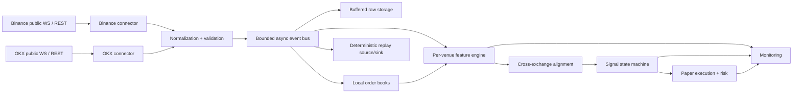
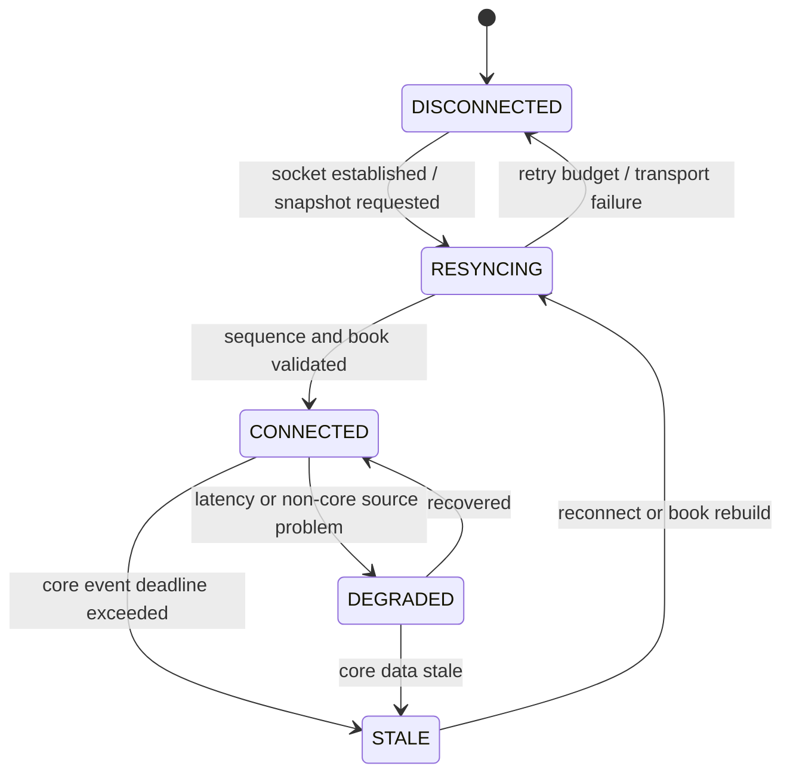

# CVF-01 Architecture

## 1. Scope and architectural stance

CVF-01 is a modular monolith. One process may host collection, normalization, feature
calculation, signaling, paper execution, and monitoring, while each responsibility is kept
behind a narrow Python module boundary. This avoids premature Kafka/Redis/microservice
operations while preserving replaceable interfaces.

The system is research and paper trading only. No component may accept private trading
credentials or create a live order.

Phase-1 implementation status:

| Area | Status |
|---|---|
| Configuration and logging | Implemented and tested |
| Normalized models and symbol maps | Implemented and tested |
| Connector interface and subscription plans | Implemented and tested |
| Real WebSocket/REST traffic | Not implemented (phase 2) |
| Storage, features, signals, paper trading, replay, UI | Module boundary only |

## 2. Target data flow

Live and replay sources join at the normalized-event boundary. Features, signals, risk, and
paper execution therefore have one implementation rather than separate live/backtest logic.

## 3. Module boundaries

### `config`

Loads the complete `default.yaml`, merges an optional overlay, applies `CVF__` environment
overrides, and validates cross-section invariants. Configuration is immutable after startup.
Safety values such as paper-only mode and disabled martingale cannot be switched on through
configuration.

### `models`

Defines immutable normalized events. Every event includes:

- venue and canonical symbol;
- exchange event time and local receive time;
- event type and optional sequence identifier;
- a reference to the preserved raw payload.

Models reject naive timestamps, invalid symbols, negative prices/quantities, crossed books,
non-finite feature values, and inconsistent signal/position levels.

### `exchanges`

`ExchangeConnector` owns lifecycle and shared health state but knows nothing about strategy.
Concrete connectors will own:

- WebSocket/REST connection setup;
- subscription payloads and heartbeats;
- exponential backoff with jitter;
- deduplication and sequence tracking;
- snapshot/resync orchestration;
- venue payload normalization.

Phase 1 implements only the contract and subscription plan. Network methods fail closed.

### `normalization` and `orderbook`

Normalization maps venue semantics into the shared models. Local books consume a REST or
WebSocket snapshot plus ordered deltas. A gap, checksum failure, or out-of-order delta moves
health to `RESYNCING`; entry signals remain blocked until a new validated snapshot is active.

### `storage`

Target design:

- append high-volume trades and book events to in-memory bounded buffers;
- flush batches to date/venue/symbol/event-type Parquet partitions;
- write signals, paper orders, positions, trades, and run metadata in batched database
  transactions;
- retain both timestamps and a raw payload reference.

Slow storage must exert bounded backpressure and become an observable degraded condition. It
must never silently discard core events.

### `features` and `strategy`

Feature state is partitioned by venue and canonical symbol. Cross-venue processing consumes
time-aligned feature snapshots, not arbitrary arrival order. Strategy receives only validated,
warm, health-qualified feature snapshots.

### `execution`, `risk`, and `paper_trading`

Execution cost is estimated independently for both venues from fee, half spread, depth-walk
slippage, latency, and depth penalties. Risk selects at most one simulated venue and sizes the
position from equity-at-risk divided by stop distance, capped by notional leverage.

### `replay` and `backtest`

Replay reads persisted normalized events in deterministic order. It can preserve recorded
inter-event timing, multiply timing by a speed factor, or run with no waits. Stable tie-break
rules and a recorded seed guarantee repeatability.

## 4. Time and ordering model

Both timestamps are mandatory because they answer different questions:

- `exchange_timestamp`: when the venue says the event occurred;
- `local_receive_timestamp`: when this process first observed the payload.

Within one sequenced channel, venue sequence numbers dominate timestamp ordering. Across
channels or venues, an alignment buffer uses exchange time, bounded clock-skew estimates, and
local receive time as a diagnostic/tie-breaker. Arrival order alone never establishes venue
leadership.

Future phase-2 decisions that require fixture verification:

1. channel-specific event-time fields;
2. snapshot/delta sequence rules and checksum scope;
3. whether a channel is lossy or aggregated;
4. units for contracts, base quantity, and quote notional;
5. instrument-specific index subscription identifiers.

## 5. Health and fail-closed behavior

Per-venue health transitions:

`STALE`, `RESYNCING`, and `DISCONNECTED` always block new entries. A held paper position uses
the conservative exit policy; health loss can never be converted into permission to enter.

## 6. Concurrency and backpressure

The target runtime uses `asyncio` with one task group per connector and bounded queues between
collection and consumers. Queue capacity, lag, drop attempts, reconnects, and buffer flush
latency are metrics. Core events are not intentionally dropped; if the process cannot keep up,
health degrades and new trading is blocked.

CPU-heavy batch analytics and Parquet writes may run in worker threads, but mutable strategy
state remains serialized per symbol to preserve deterministic behavior.

## 7. Storage and schema evolution

Every persisted record carries `strategy_version` or a schema/run version. Parquet partitions
are immutable after successful close. Schema additions should be backward-compatible where
possible; incompatible changes require a new schema version and explicit replay adapter.

SQLite is permitted locally. Repository code will target SQLAlchemy abstractions compatible
with PostgreSQL, while high-frequency events avoid row-at-a-time database writes.

## 8. Security and operational constraints

- No live trading endpoints or credential settings.
- Public endpoints only in phases 1–4.
- Structured logs must not include secrets if later read-only keys are introduced.
- Configuration and raw payload validation fail loudly.
- Shutdown stops producers, drains bounded buffers within the configured timeout, then closes
  storage and transport resources.

## 9. Phase gates

Phase 2 starts only after phase 1 installs, imports, runs one-shot, and passes tests. Each later
gate requires deterministic fixtures and explicit evidence:

1. collection correctness and recovery;
2. feature calculation against hand-computed fixtures;
3. signal/state-machine truth tables;
4. paper fill/risk accounting invariants;
5. repeated replay equality;
6. browser-visible monitoring verification.

